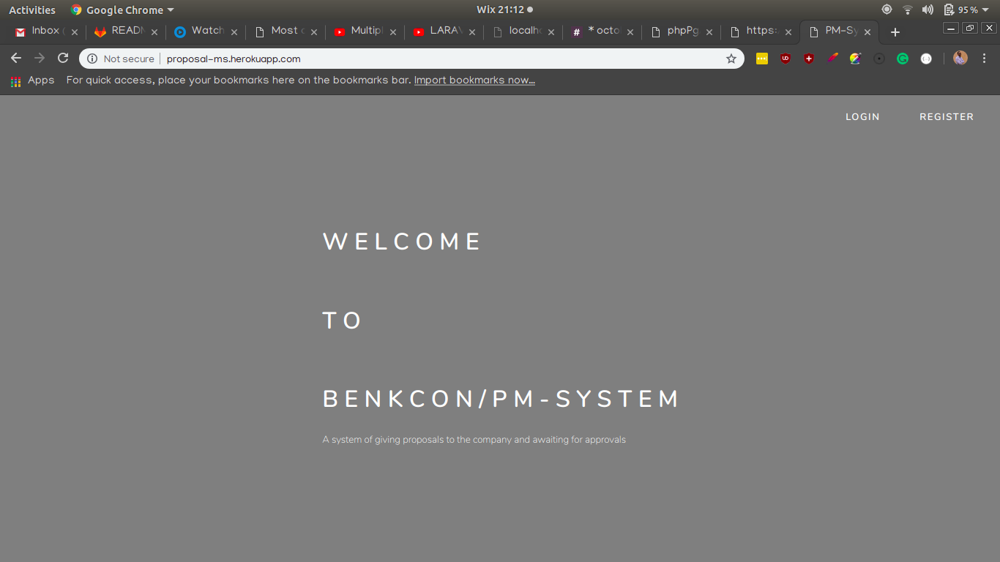
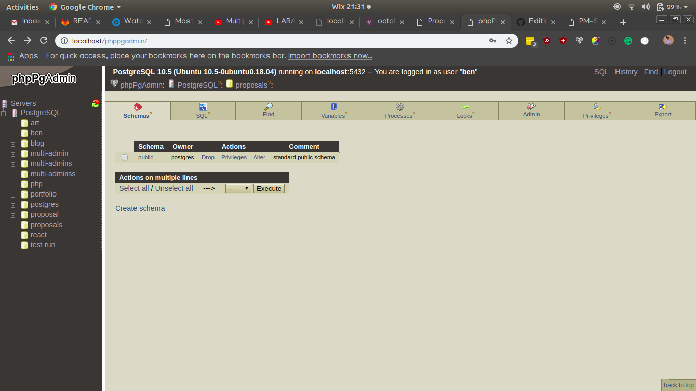
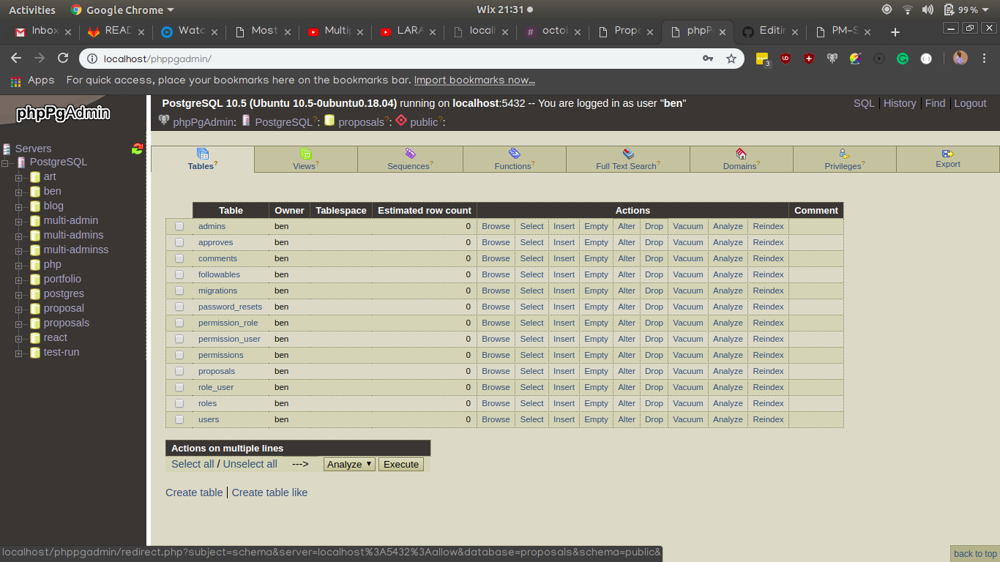
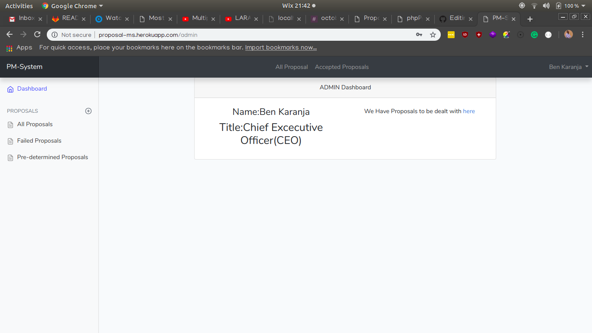
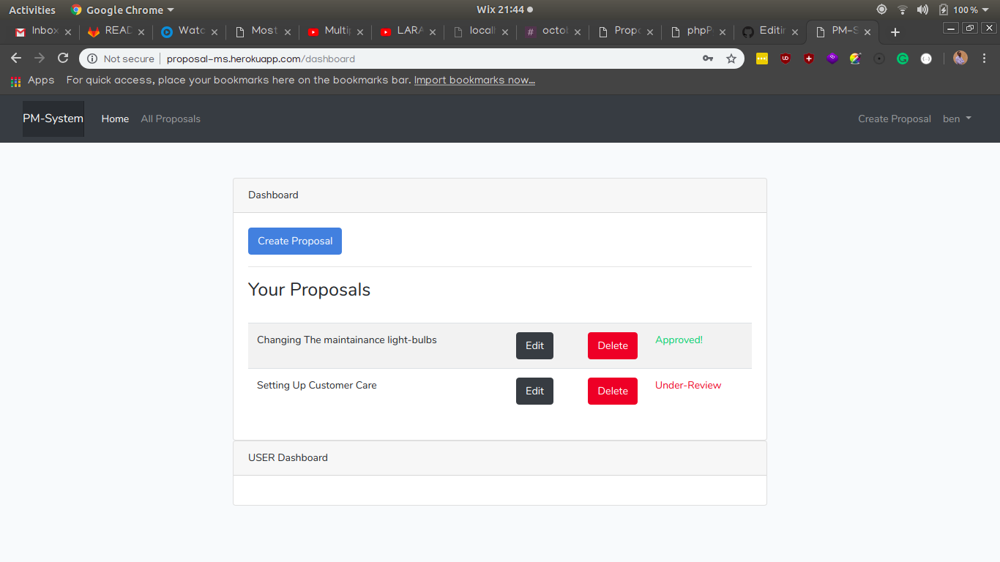

 PM-System 
======================

This is an application based on managing proposals and determining if it is valid or not.


## Getting Started

To get started, you will need to do the following.

Clone the repository:

```bash
$ git clone https://github.com/Benard18/Proposal-Managment-System

or

$git clone https://git.ralphowino.com/ben/PM-System

```

To initialize laravel you have to run the folllowing commands:
```bash
$cd PM-System

$ composer install
```
. See deployment for notes on how to deploy the project on a live system.

### Prerequisities

+ [PHP](http://www.php.net/) - `Version >= 7.0`
+ A standard web server-example- [Apache2](https://help.ubuntu.com/lts/serverguide/httpd.html)
+ [PHPpgAdmin](http://phppgadmin.sourceforge.net/) - A database setup based on postgresql-`Version >= 9.0`
+ [Composer](https://getcomposer.org/) `Version >= 1.7`

This is based on the LAMP stack installation that you implement in your linux distribution[.Here is a short tutorial on what to do](https://www.digitalocean.com/community/tutorials/how-to-install-linux-apache-mysql-php-lamp-stack-ubuntu-18-04).

Before embarking on the application, have some peaceful and calming knowledge based on PHP and it's syntax. It is basically in the same format as JavaScript and more advanced so it's easy to learn.


### Installing

After cloning and installing the laravel injections, run the following command if you have apache installed.


```bash
$ php artisan serve
```

This will run on the application on your [localhost](127.0.0.1:8000) if you have the apache2 server side.

You should be seeing the application server side.

It should display like this.


### Implementing the database.

if you have PHPpgAdmin and postgresql installed you will have a really easy time Here.

Because I have already prepared the migrations this will just be easy to show.

We will run an artisan command to migrate our information to your local db.

First of all let us put in the Database information.
This will be found in the .env folder


```text
DB_CONNECTION=pgsql
DB_HOST=127.0.0.1
DB_PORT=5432
DB_DATABASE=proposals
DB_USERNAME=<name of super user in psql>
DB_PASSWORD=<password>
```
This is how your information should be displayed. Make sure .env is in your .gitignore. We do not want problems with security.


And we will head to our `config/database.php` to edit the following information
```php
     // $url = parse_url(getenv("DATABASE_URL"));
     //
     // $host = $url["host"];
     // $username = $url["user"];
     // $password = $url["pass"];
     // $database = substr($url["path"], 1);

    ...

    'pgsql' => [
    'driver' => 'pgsql',
    'host' => env('DB_HOST', '127.0.0.1'),
    'port' => env('DB_PORT', '5432'),
    'database' => env('DB_DATABASE', 'forge'),
    'username' => env('DB_USERNAME', 'forge'),
    'password' => env('DB_PASSWORD', ''),
    'charset' => 'utf8',
    'prefix' => '',
    'schema' => 'public',
    'sslmode' => 'prefer',
],
```
We are going to edit this sections of code so as to correspond with the database configuration your other end.

In postgresql, go to the command line and make a database called proposal.

This will allow you to migrate your information to the database.

```bash
$ php artisan migrate
```

As you have done the following, head to your PHPpgAdmin server side
server should be in this format - [https://localhost/phppgadmin](localhost/phppgadmin)

You will have the following information being displayed.



When you click on the public table, you will find columns and you can edit them when you want to as show below.

## Running the tests

I have not done the test at the moment but will surely be doing this after sometime.

### Becoming an Admin

We have the administration area of the application.
To become an administrator we would need to use Laravel Tinker.

To do so we will do the following
```bash
$php artisan tinker //in the local machine
$heroku run php artisan tinker //in the production area in heroku

>>$admin = new App\Admin
>>$admin->name = "<name>"
>>$admin->password = Hash::make('<password>')
>>$admin->job_title = "<title>"
>>$admin->email = "<email>"
>>$admin->save()

```

This will create an administrator and will be prompted to login with the `/admin` URI.

The admin dashboard looks like this.



not like this



## Built With

* [Laravel](https://laravel.com/) - The web framework used by `Artisans`
* [PHP](http://www.php.net/) - Language
* [PHPpgAdmin](http://phppgadmin.sourceforge.net/) - A database setup based on postgresql-`Version >= 9.0`

## Versioning

I use [Github](http://github.com/) for versioning. For the versions available, see the [tags on this repository](https://github.com/Benard18/Blog-PHP/tags).

## Authors

* **Ben Karanja** - *Initial work* - [Benard18](https://github.com/Benard18)

## License

This project is licensed under the MIT License - see the [LICENSE.md](LICENSE.md) file for details

## Acknowledgments

* [RalphowinoConsulting](https://github.com/ralphowino)
* Inspiration//Coffee!!!
* etc
